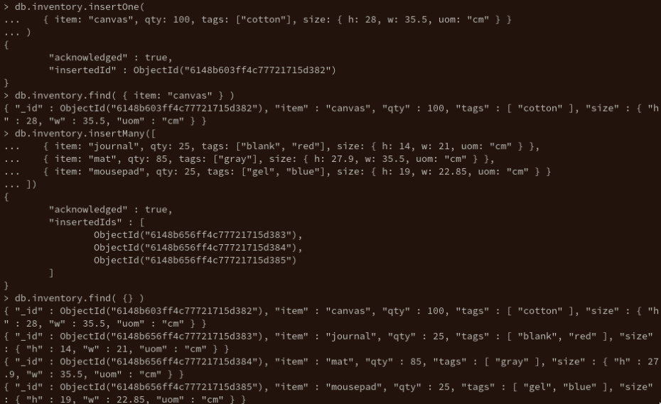
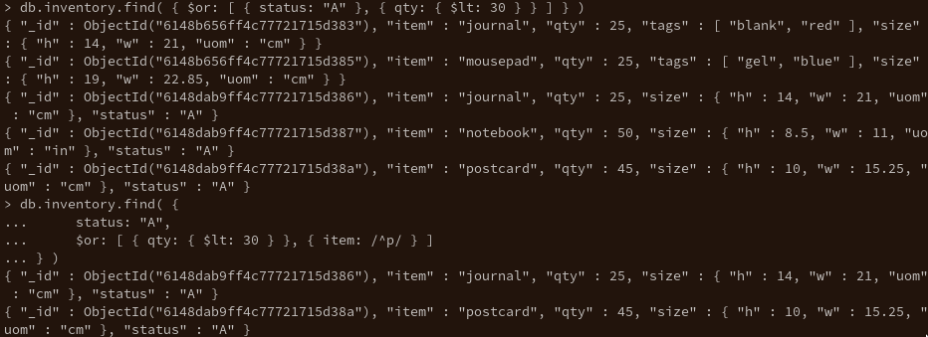
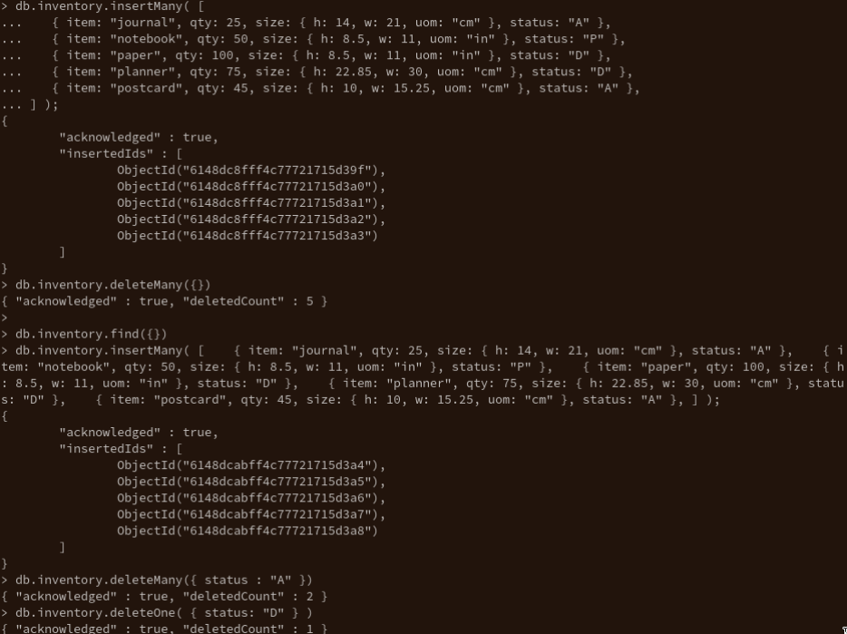
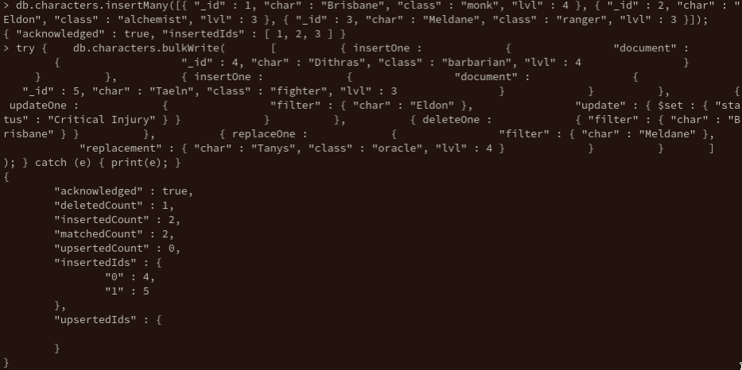
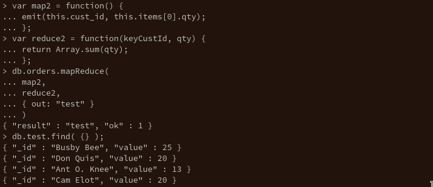

# Expass 3

## MongoDB installation
The installation process was quite straight forward. I use arch linux, so i just grabbed `mongodb-bin` and `mongodb-tools-bin` from the "Arch User Repository". This also simplifies the part of verifying SHA256 checksums as this is done automatically during the installation process.

## Experiment 1
**Insert Documents**

**Query Documents**

**Update Documents**

**Remove Documents**

**Bulk Write Operations**

## Experiment 2
For the custom `mapReduce`-function I decided to implement a function that works on the same dataset as the example. The function find the total number of items in each users cart.

## Pending issues
No big issues, except that I noticed `mapReduce` is deprecated in version 5.
